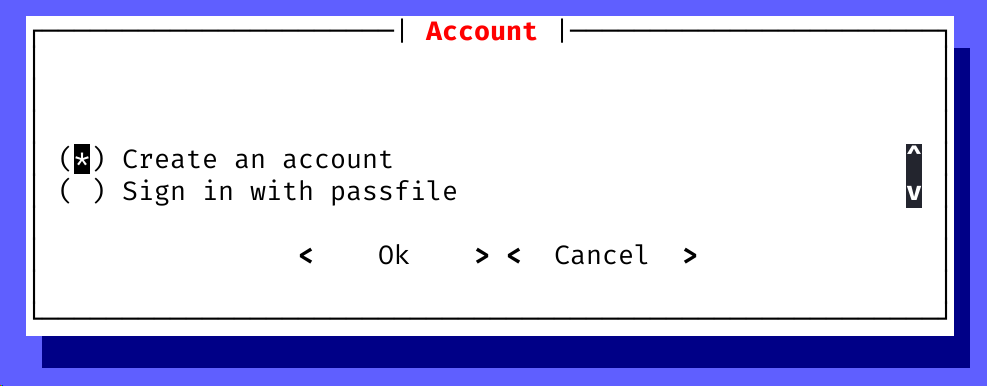

<h1 align="center">Bonfire</h1>

<h3 align="center">An arcade for security research</h3>

<p align="center">
    
</p>

<p align="center">
    
</p>

Bonfire is a free software, and you are welcome to redistribute it.

For non-opensource and advanced features, please get in touch with colabar@protonmail.com.

## Install

Download the latest deb package on the [release page](https://github.com/colabar/bonfire/releases/latest), and then execute the following command to install it:

```sh
sudo apt update
sudo apt install ./bonfire_*-linux_amd64.deb
```

## Run

Execute `sudo bonfire` to run the program.

When running the bonfire for the first time, we will get a welcome dialog as follows:


Choose "Create an account":



If successful, we will enter the interactive command line of bonfire:

```
██████╗  ██████╗ ███╗   ██╗███████╗██╗██████╗ ███████╗    ██╗     ██╗████████╗
██╔══██╗██╔═══██╗████╗  ██║██╔════╝██║██╔══██╗██╔════╝    ██║     ██║╚══██╔══╝
██████╔╝██║   ██║██╔██╗ ██║█████╗  ██║██████╔╝█████╗      ██║     ██║   ██║   
██╔══██╗██║   ██║██║╚██╗██║██╔══╝  ██║██╔══██╗██╔══╝      ██║     ██║   ██║   
██████╔╝╚██████╔╝██║ ╚████║██║     ██║██║  ██║███████╗    ███████╗██║   ██║   
╚═════╝  ╚═════╝ ╚═╝  ╚═══╝╚═╝     ╚═╝╚═╝  ╚═╝╚══════╝    ╚══════╝╚═╝   ╚═╝   
vX.X.X

Run `help` for more information

[bonfire]
>
```

## Launch nopal

<!-- What is nopal? -->

From interactive command line of the bonfire, you can execute the following command to launch a nopal:

```
[bonfire]
> launch NOPAL_CMD
```

## Documentation

Head over to the [documentation](https://colabar.github.io/bonfire/usage) to start playing!

## Support Bonfire

You can use cryptos to support the project so that it can continue to provide free content. Thanks!

Our cryptos address:

```
Bitcoin address:
bc1q8s22n89vpfw3qa275zgapmlkvccvqcp6wlavdl

Tether ERC20 address:
0x6CA26eb010c845A9d904E343172b7537D40d1c54
```

<p align="center">
    
    
</p>
